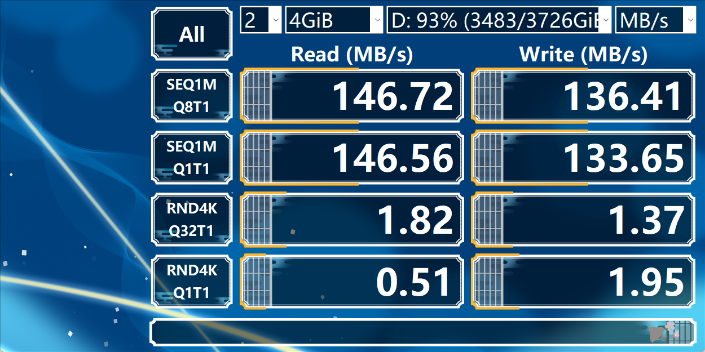
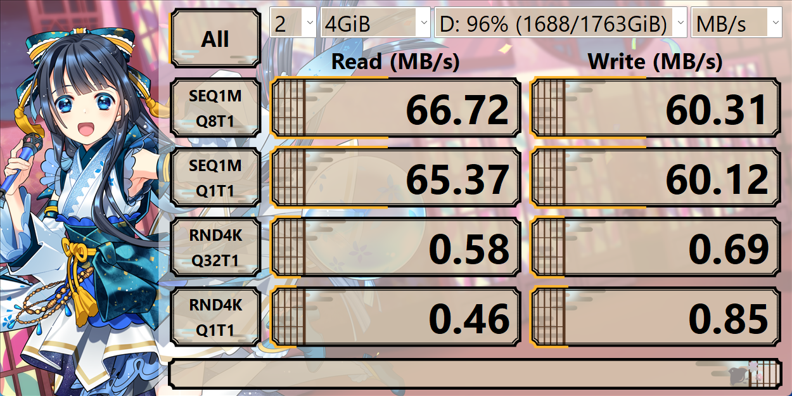
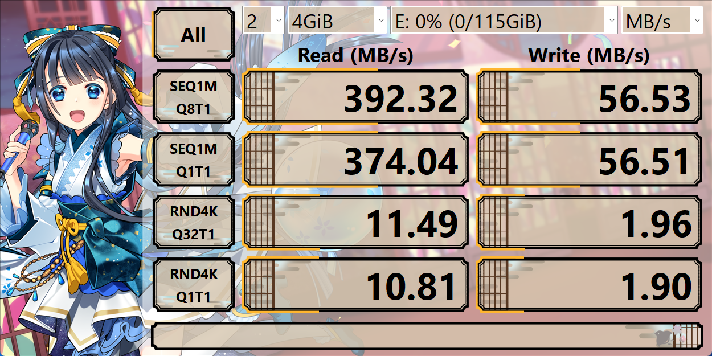
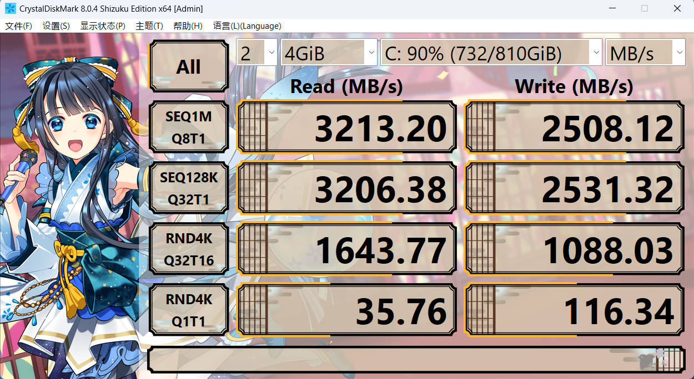
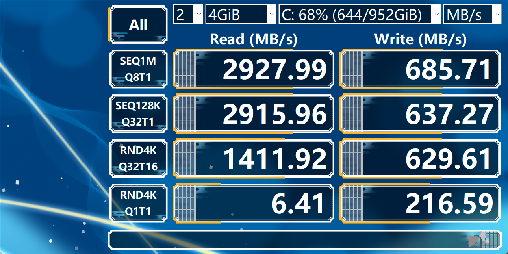
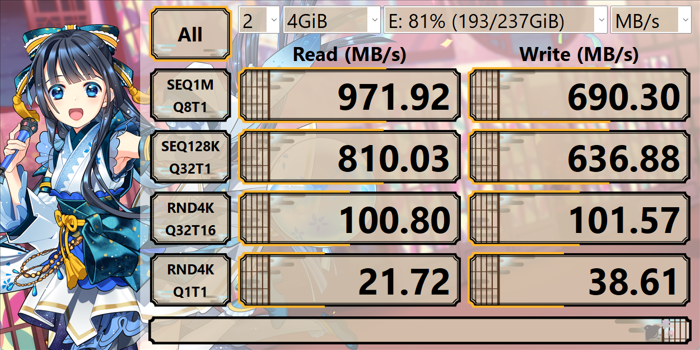

# 硬盘选购前置知识-传输速度与接口

硬盘选购中，传输文件/读写文件的速度是大家比较关心的一个方面。这个速度受到2个方面限制，1）硬盘自身从磁盘或者闪存颗粒上的读写速度，2）传输协议的速度。最终的传输速度取决于这2个速度中最慢的那一个。

注意，传输协议的意思是USB2.0、3.0等，和传输接口的意思不一样，后者指的是USB-A口（常见的矩形的口）、USB-C口（常见的typeC口）等等。传输协议由芯片而不是接口的长相决定。就如同广为人知的问题，一个typeC的接口在使用前，我们无法知道他到底是只能充电的接口，还是有USB3.0传输速度的口，还是有视频输出功能的雷电口。

# 1. 常见的传输协议及其理论上限传输速度

| 传输协议[^2] | 上限传输速度 |
| ---- | ---- |
| USB2.0 | 60 MBytes/s |
| USB3.2 Gen1 (3.0) | 5 Gbit/s or 600 MBytes/s |
| USB3.2 Gen2 (3.1) | 10 Gbit/s or 1250 MBytes/s |
| USB3.2 Gen2×2 (3.2) | 20 Gbit/s or 2500 MBytes/s |
| SATA 3[^1] | 6 Gbit/s or 600 MBytes/s |
| Thunderbolt 3  | 40 Gbit/s[^3] |

# 2. 旧有硬盘速度测试与比较

## 2.1 机械硬盘

据网上了解，最新的机械硬盘不过200 MB/s的读或者写速度，就下图的结果来看机械硬盘和固态差距较大，无论是大文件还是小文件读写。

**购买硬盘和传输协议的速度比较：**机械硬盘远远达不到USB3.0传输接口的限制，如果购买外置的机械硬盘的话，用SATA转USB的硬盘柜方案没有一点问题。

4T 西数红盘，购买于2022年冬

hp 笔记本自带，2T，2.5英寸硬盘，zhan99 Gen1，购买于2019年春

## 2.2 固态硬盘

从下图的几个结果综合来看，固态硬盘除了U盘这样的较弱的闪存盘之外，如果是比较新的固态硬盘，大文件和小文件读取速度在1 GB/s以上很正常，写入速度可能腰斩（这个决定了拷贝文件的速度）。然后4K读写，即小文件读写速度比机械硬盘要快得多。

**购买硬盘和传输协议的速度比较：**固态硬盘如果是正经买的NVMe协议的固态，比如下方第2、3张图，那么要么转接雷电口，要么还是老老实实插在电脑内部的插槽内，不然都可能受到传输接口的速度限制。如果是U盘，较好品质的U盘也不尚在USB3.0传输协议的速度范围内。

**购买U盘：**请更换U盘以适应USB3.0的接口，或者用闲置的固态改装成硬盘盒做U盘。否则，你的U盘可能连USB2.0的传输速度上限都达不到，拷贝文件真的很慢。另外，由于都是闪存盘，写入文件比从U盘读文件是很正常的，因此要预留更多的时间从其他人电脑上拷贝数据。U盘比正常的固态性能差很多，请不要将程序或者数据放在U盘里跑。

120GB sandisk U 盘，购买于2023年冬

1T，西数固态，购买于2022年冬

1T，固态硬盘，购买于2023年春，台式机自配

1T，hp 自带 SSD，zhan99 Gen1，购买于2019年春

---

[^1]: [SATA - Wikipedia](https://en.wikipedia.org/wiki/SATA#Protocol)
[^2]: [各版本USB接口和雷电（Thunderbolt）接口的速度 - 知乎](https://zhuanlan.zhihu.com/p/492693636)
[^3]: [相较雷电3，雷电4都改进了什么呢？ - 知乎](https://zhuanlan.zhihu.com/p/164420917)
